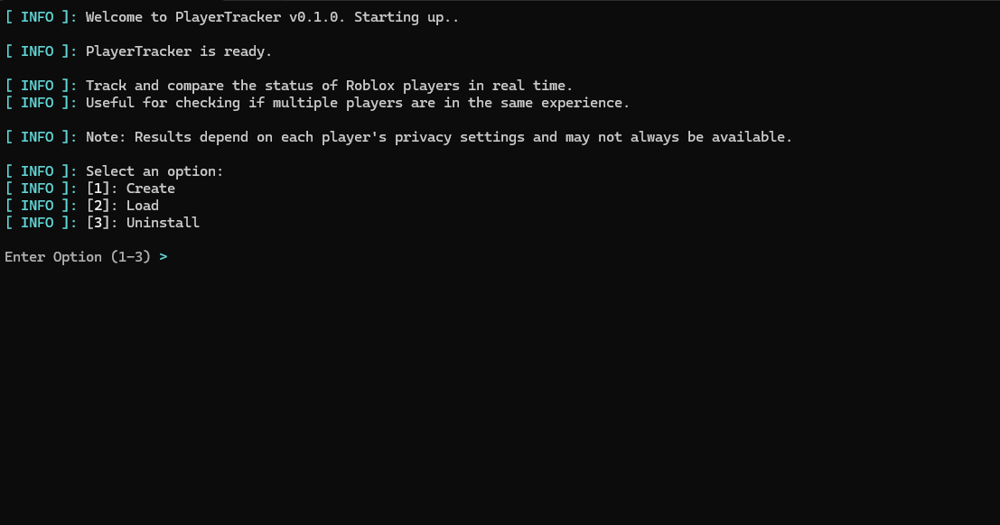

# PlayerTracker

**Monitor Roblox player statuses in real time from your terminal**

## Overview

PlayerTracker is a Windows CLI tool that lets you track the presence statuses of Roblox players across a customizable list of User IDs. At a glance, you can see who is Offline, Online, or currently Playing, all from your terminal.

It supports managing a personal list of User IDs, assigning nicknames (referred to interchangeably as 'usernames' in the codebase), and displaying a clean results view with per-status summaries and detailed breakdowns.

> **Note:** Results depend on each player's privacy settings. Players with private presence will always appear as Offline. This is a Roblox limitation.

## Features

- Track up to **100** Roblox players by User ID
- View presence statuses: **Offline**, **Online**, and **Playing**
- Assign and manage nicknames per User ID for easier identification
- Built-in cooldown system to respect Roblox's API limits
- Fast concurrent batch requests across large player lists

## Installation

Head to the [Releases](https://github.com/Expansionator/roblox-player-tracker/releases) page, download the latest .zip, and extract it.

No Python installation required.  
PlayerTracker ships as a standalone `.exe`.

## Documentation

| | |
|---|---|
| [Getting Started](docs/user/getting-started.md) | Installation, first run, and full usage guide |
| [Configuration](docs/user/configuration.md) | Config file settings and what they control |
| [Help](docs/user/help.md) | Common issues, error messages, and reset steps |
| [Setup](docs/dev/setup.md) | Local dev environment and project structure |
| [Presence Reference](docs/dev/presence-reference.md) | Roblox Presence API details and internal mappings |
| [Architecture](docs/dev/architecture.md) | System design, data flow, and engineering patterns |

## Tech Stack

| | |
|---|---|
| Language | Python 3.13 |
| Packaging | PyInstaller |
| HTTP | requests |
| Terminal UI | rich, alive-progress |
| Rate Limiting | diskcache |
| Type Checking | pyright |
| Linting | ruff |

## License

This project is licensed under the [MIT License](LICENSE).
